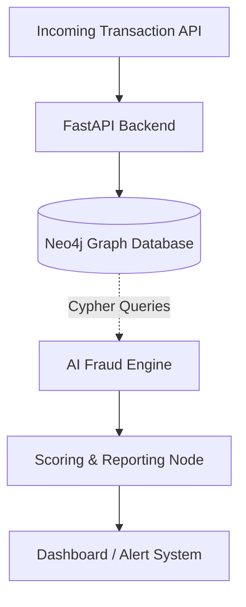

# Neo4j Evidence & FCA Complaint System


## 📖 Overview
The **Neo4j Evidence & FCA Complaint System** is an advanced graph-based fraud investigation tool. By linking disparate identity nodes, complex transactional datasets, and official FCA complaints into a Neo4j graph database, this system utilizes graph traversal algorithms to surface hidden syndicates and detect multi-hop financial fraud anomalies.

## ✨ Key Features
- **Graph-Based Relationship Extraction:** Maps Accounts, IPs, Addresses, and Transactions to find hidden loops and structural similarities.
- **Entity Resolution:** AI models designed to deduplicate and merge fragmented identity information into unified nodes.
- **Automated FCA Reporting:** Programmatically drafts Financial Conduct Authority standard reports when fraud confidence scores exceed thresholds.
- **Fraud Scoring API:** Real-time scoring of incoming transactions based on graph proximities to known bad actors.

## 🏗 System Architecture


## 📂 Repository Structure
- `ai_engine/`: Graph ML algorithms and complaint context generators.
- `backend/`: Cypher query orchestrators and HTTP REST APIs for dashboard ingestion.
- `infra/`: Docker compose files spanning the application and the Neo4j instance.

## 🚀 Getting Started

### Local Development
1. Spin up the graph database dependency:
   ```bash
   docker-compose up -d neo4j
   ```
2. Clone exactly and install libraries:
   ```bash
   pip install -r requirements.txt
   ```
3. Run the backend API:
   ```bash
   uvicorn backend.main:app --host 0.0.0.0 --port 8000
   ```

## 🛠 Known Issues
- Real-time graph analytics latency occasionally spikes > 150ms.

## 🤝 Contributing
Contributions mapping new typologies (e.g., synthetic identity fraud patterns) via Cypher queries are welcome.

## ?? Future Roadmap & Enhancements
- **LLM Graph Navigator**
- **Temporal graph modeling**
